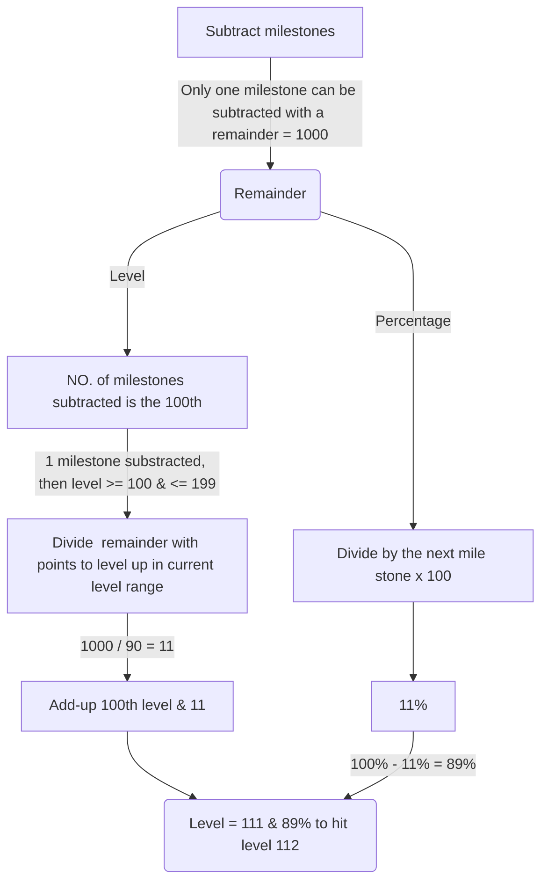

# *MyTrophies*

Trophy hunter with a jailbroken PS4? this might be helpful for you. A Trophy calculator application running on a localhost server, connects to PS4 directly through `FTP`. SOON! will support manual calculation for non-jailbroken consoles.

##### NOTE: Chrome is required to run this application

### *Download Latest release:-*

##### <https://github.com/OfficialAhmed/MyTrophies-PS4/releases>

### *Update v3.12 Notes (Not compiled):-*

- **[Feature]** *Manual calculations for non-jailbroken PS4/PS5*
- **[Fixed]** *Calculation issues*

### *Noobs Tutorial:-*

- Download ZIP file from the provided link and extract the file

- Always run exe as administrator

- Enter PS4 IP/Port

- Click on `Connect`

- Click on `Fetch`

- From the dropdown list pick the desired PS4 account

> To Compile it (After requirements installation)
`python -m eel MyTrophies.py UI --noconsole --onefile --icon=icon.ico`

# User Interface

# *How it works*

The application reads PS4 users' trophies and do many arithmetic calculation
based on the new PlayStation trophy system as shown down below:

##### *NEW TROPHY SYSTEM*

##### `Credits to <https://forum.psnprofiles.com/topic/96498-new-platinum-trophy-value-and-trophy-level-formula/>`

Points awarded when earning a trophy
|             |Points           |  
|-------------|-----------------|
|Bronze       |15               |
|Silver       |30               |
|Gold         |90               |
|Platinum     |300              |
____
The level determined by reaching a certain points milestone
|Level range|  points to level up | Total points(Milestone)|
|-----------|---------------------|------------------------|
|0-99       |60                   | 6000
|100-199    |90                   | 9000
|200-299    |450                  | 45,000
|300-399    |900                  | 90,000
|400-499    |1350                 | 135,000
|500-599    |1800                 | 180,000
|600-699    |2250                 | 225,000
|700-799    |2700                 | 270,000
|800-899    |3150                 | 315,000
|900-999    |3600                 | ∞

____
This is how the application determine different logic

- #### User level & percentage

`assume user points = 7000`

